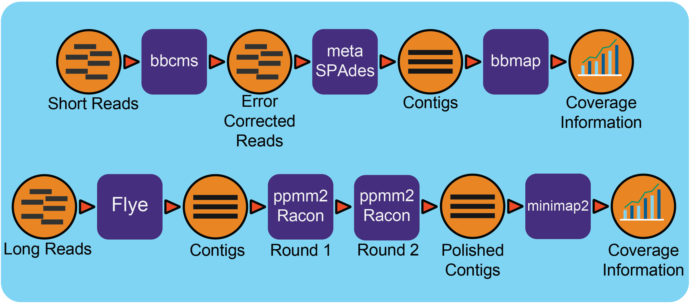

The Metagenome Assembly Workflow
================================

Summary
-------
This workflow is developed by Brian Foster at JGI and original from his `repo <https://gitlab.com/bfoster1/wf_templates/tree/master/templates>`_. It take paired-end reads runs error correction by bbcms (BBTools). The clean reads are assembled by MetaSpades. After assembly, the reads are mapped back to contigs by bbmap (BBTools) for coverage information.

Workflow Diagram
------------------

Workflow Dependencies
---------------------
Third party software
~~~~~~~~~~~~~~~~~~~~

- MetaSPades v3.13.0 (GPLv2)
- BBTools:38.44 `(BSD-3-Clause-LBNL) <https://bitbucket.org/berkeleylab/jgi-bbtools/src/master/license.txt>`_

Database
~~~~~~~~
- None

Workflow Availability
---------------------
The workflow is available in GitHub:
https://github.com/microbiomedata/metaAssembly

The container is available at Docker Hub (microbiomedata):

https://hub.docker.com/r/microbiomedata/spades

https://hub.docker.com/r/microbiomedata/bbtools

Test datasets
-------------

Zymobiomics mock-community DNA control `(SRR7877884) <https://www.ebi.ac.uk/ena/browser/view/SRR7877884>`_

Details
-------

The .wdl (Workflow Description Language) file includes five tasks, `bbcms`, `assy`, `create_agp`, `read_mapping_pairs`, and `make_output`. 

The `bbcms` tasks takes interleaved fastq inputs and perform error correction, reformat interleaved fastq into two output fastq files for paired-end reqads for next tasks. 
The `assy` task performs metaSPAdes assembly. 
Contigs and Scaffolds output of metaSPAdes are consumed by `create_agp` task to rename the fasta header and generate `AGP <https://www.ncbi.nlm.nih.gov/assembly/agp/AGP_Specification/>`_ format which describes the assembly. 
The `read_mapping_pairs` task maps reads back to the final assembly and generated coverage information.
The final `make_output` task will pop all above output files into specified directory.

Inputs
~~~~~~

.. code-block:: JSON

	{
	  "jgi_meta.input_file":["/path/to/SRR7877884.fastq.gz"],
	  "jgi_meta.rename_contig_prefix":"SRR7877884",
	  "jgi_meta.outdir":"/path/to/SRR7877884_assembly"
	}

* The json file includes three parts: 

    1. fastq (illumina paired-end interleaved fastq)
    
    2. contig prefix for fasta header
    
    3. output path
    
.. note::
    
    If the input is paired-end fastq file, it should be in interleaved format. Below is command use the SRR7877884 as example to convert the paired-end reads in two files into one interleaved format fastq file.
    
.. code-block:: bash    
    
    paste <(zcat SRR7877884_1.fastq.gz | paste - - - -) <(zcat SRR7877884_2.fastq.gz | paste - - - -) | tr '\t' '\n' | gzip -c > SRR7877884-int.fastq.gz

Outputs
~~~~~~~

The output will have four sub-directories, bbcms, final_assembly, mapping and spades3. The main assembly contigs output is in final_assembly/assembly.contigs.fasta.

Below is a part list of all output files:: 

	├── bbcms
	│   ├── berkeleylab-jgi-meta-60ade422cd4e
	│   ├── counts.metadata.json
	│   ├── input.corr.fastq.gz
	│   ├── input.corr.left.fastq.gz
	│   ├── input.corr.right.fastq.gz
	│   ├── readlen.txt
	│   └── unique31mer.txt
	├── final_assembly
	│   ├── assembly.agp
	│   ├── assembly.contigs.fasta
	│   ├── assembly.scaffolds.fasta
	│   └── assembly.scaffolds.legend
	├── mapping
	│   ├── covstats.txt
	│   ├── pairedMapped.bam
	│   ├── pairedMapped.sam.gz
	│   ├── pairedMapped_sorted.bam
	│   └── pairedMapped_sorted.bam.bai
	└── spades3
		├── assembly_graph.fastg
		├── assembly_graph_with_scaffolds.gfa
		├── contigs.fasta
		├── contigs.paths
		├── scaffolds.fasta
		└── scaffolds.paths

Requirements for Execution
--------------------------

- Docker or other Container Runtime
- Cromwell or other WDL-capable Workflow Execution Tool
- The memory requirement depends on the input complexity. Here is a simple estimation equation based on kmers.
  
  predicted_mem = (kmers * 2.962e-08 + 1.630e+01) * 1.1 (in GB)
  
.. note::     

   `kmers` variable can get from `kmercountmulti.sh` script from BBTools.
   
   kmercountmulti.sh -k=31 in=your.read.fq.gz

Running Workflow in Cromwell on Cori
------------------------------------
We provide three ways to run the workflow.

1. CromwellJtmShifter/: The Cromwell run in head node send tasks to jtm-task-managers which will manages the tasks running on a computer node and using Shifter to run applications.

2. SlurmCromwellShifter/: The submit script will request a node and launch the Cromwell. The Cromwell manages the workflow by using Shifter to run applications.

3. CromwellSlurmShifter/: The Cromwell run in head node and manages the workflow by submitting each step of workflow to compute node where applications were ran by Shifter.

Description of the files in each sub-directory:

- .wdl file: the WDL file for workflow definition
- .json file: the example input for the workflow
- .conf file: the conf file for running Cromwell.
- .sh file: the shell script for running the example workflow
	

Version History
---------------
- 1.0.0

Point of contact
----------------
Original author: Brian Foster <bfoster@lbl.gov>

Package maintainer: Chienchi Lo <chienchi@lanl.gov>
